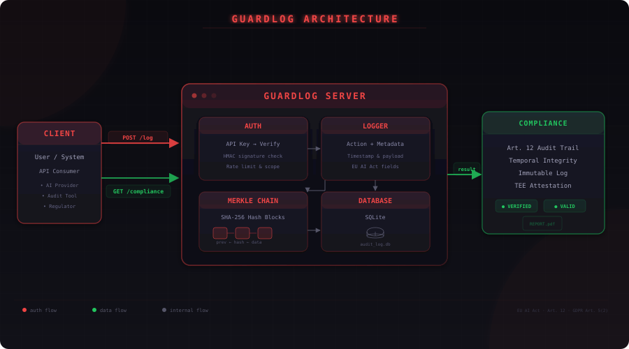

GuardLog is a lightweight API that gives you a complete, verifiable audit trail for every AI action in your system — in five minutes.

## Architecture



GuardLog sits between your AI system and your compliance data. Every action flows through a SHA-256 Merkle chain:

```
User/System ── POST /log ──▶ GuardLog Server
                                   │
                     ┌─────────────┼─────────────┐
                     ▼             ▼             ▼
                   Auth        Logger      Merkle Chain
                   (API key)   (metadata)  (SHA-256 blocks)
                     │             │             │
                     └─────────────┼─────────────┘
                                   ▼
                          SQLite Audit Store
                                   │
                                   ▼
                          Compliance Export
```

